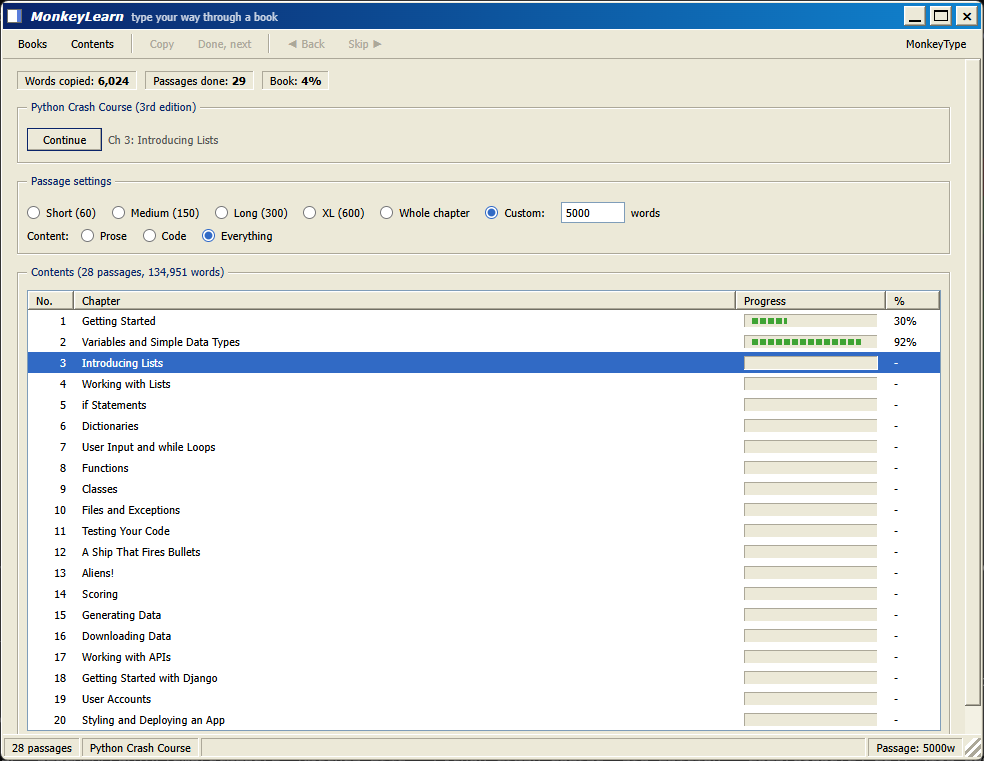
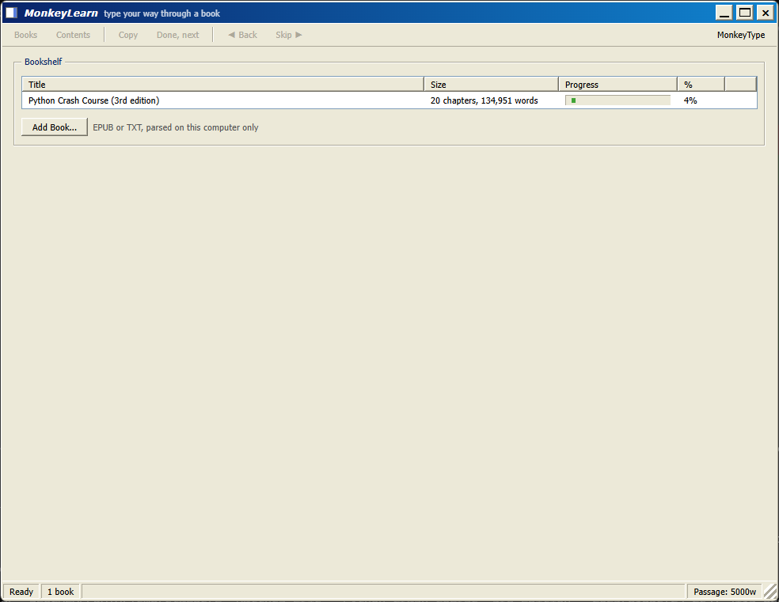

# MonkeyLearn

Type your way through real books on [MonkeyType](https://monkeytype.com) - and actually
learn something while practicing.

MonkeyLearn is a small Windows desktop app that holds your books, slices them into
typing-sized passages, and feeds them to your clipboard one **Copy** at a time. You paste
each passage into MonkeyType's custom text mode and type; the app keeps your bookmark,
per-chapter progress, and shelf of books. The typing itself always happens on the real
MonkeyType site - this is a companion, not a typing engine.

The interface is a deliberate love letter to Windows 98/XP: beveled buttons, engraved
group boxes, segmented progress bars, a gradient title bar, and a PictoChat-style frame
around the text you are about to type.





## How to use it

1. Start MonkeyLearn. Click a book on the shelf, or **Add Book...** to import your
   own - EPUB, PDF, and TXT are supported, parsed entirely on your machine.
2. Pick a passage length: Short (60 words), Medium (150), Long (300), XL (600),
   Whole chapter, or a custom word count. Pick content: Prose, Code, or Everything
   (the toggle hides itself for books with no code).
3. Press **Begin**. The first passage is already on your clipboard.
4. Set up MonkeyType (once per session):
   - On [monkeytype.com](https://monkeytype.com), pick **custom** in the mode bar
     above the words, then click **change** - the custom text editor opens.
   - Paste the passage (Ctrl+V).
   - Turn **off** any shuffle/randomize option so the text stays in book order,
     and leave the word limit empty so the whole passage is used.
   - If the passage has line breaks (code), enable **replace control characters** -
     MonkeyLearn copies line breaks as literal `\n` marks, and this setting turns
     them back into real line breaks. The app reminds you when a passage needs it.
   - Confirm, and type.
5. Back in MonkeyLearn, press **Done, next** (or Enter): your progress is recorded
   and the next passage is already on the clipboard. Paste it into the same custom
   text editor and keep going - that is the whole loop.

Tip: MonkeyType's custom text editor can also **save** a text under a name (the
"saved texts" list). Saving a chapter there is handy when you want to retype it
for speed later without touching your reading position in MonkeyLearn.

Skip moves past a passage without counting it; Done is what records progress.

Shortcuts on the passage view: `C` copy again, `Enter` done + next, Left/Right
back/skip, Up/Down and PgUp/PgDn scroll the text, `Esc` contents.
The window is drawn by the app itself - drag it by the blue title bar, resize with
the grip in the bottom-right corner.

## How it works

A book is imported once into a stream of blocks (headings, prose paragraphs, code
listings) and stored as JSON in `%APPDATA%\MonkeyLearn\books\`:

- **EPUB**: the app reads the book's own manifest for reading order and its table of
  contents for chapter names. Figures, captions, and tables are dropped; typographic
  characters are normalized to plain ASCII so every character is typeable.
- **PDF**: chapters come from the PDF's own outline (bookmarks), drilling past
  "Part I"-style groupings to the real chapter level; running headers, footers, and
  page numbers are stripped by detecting lines that repeat across pages; hard-wrapped
  lines are rebuilt into paragraphs and hyphenated words rejoined. Scanned PDFs
  without a text layer are rejected with a pointer to OCR tools rather than
  imported as garbage. Extraction quality still varies with how the PDF was made -
  prefer EPUB when you have both.
- **TXT**: paragraphs split on blank lines; lines like "Chapter 5" become chapter
  breaks, and books without them are cut into navigable parts.

Passages are then built live, on every settings change: whole sentences (and code
blocks) are packed in book order up to your word target, breaking only at a sentence end
or a chapter end, with short chapter tails folded into the previous passage. Your
bookmark is stored as a position in the book rather than a passage number, so changing
passage length never loses your place.

Progress lives in `%APPDATA%\MonkeyLearn\state.json`. Nothing ever leaves your computer.

## Building from source

Requires Python 3.12+ on Windows with WebView2 (preinstalled on Windows 11).

```
pip install pywebview pyperclip pypdf pyinstaller
cd typing/app
python main.py             # run from source
pyinstaller --noconfirm --onefile --windowed --add-data "ui.html;." --icon monkeylearn.ico -n MonkeyLearn main.py
```

No book text ships in this repository, and none is needed: the app starts with an
empty shelf and you add books through **Add Book...** (EPUB, PDF, or TXT).
Optionally, `python make_data.py` builds a bundled starter book from an EPUB you
place in the repository root - add `--add-data "data.json;."` to the pyinstaller
command to bake it in.

## Themes

The Appearance section on the shelf offers four classic Windows schemes (Luna Blue,
Olive Green, Silver, and Midnight - a dark mode) plus a dropdown of 141 palettes from
[MonkeyType's official themes](https://github.com/monkeytypegame/monkeytype), each one
re-derived into the full retro widget system (bevels, title bar, selection, progress
blocks) from its core colors. Themes with too little contrast for a dense 11px UI are
filtered out at build time. Theme palettes are the work of the MonkeyType project and
its contributors.

## Running on Linux

The code is portable (config lives in `~/.config/MonkeyLearn` on Linux,
`%APPDATA%\MonkeyLearn` on Windows), but so far it has only been tested on
Windows 11 - reports welcome. To run from source on Linux you need:

- GTK WebKit for pywebview: `sudo apt install python3-gi gir1.2-webkit2-4.1`
  (or use the Qt backend: `pip install pywebview[qt]`)
- A clipboard helper for pyperclip: `sudo apt install xclip` (X11) or
  `wl-clipboard` (Wayland)
- Then: `pip install pywebview pyperclip pypdf` and `python3 typing/app/main.py`

The app draws its own window frame; if your window manager handles frameless
windows poorly, set `MONKEYLEARN_SYSTEM_FRAME=1` to use the normal OS frame
instead. A Linux binary can be built with PyInstaller on a Linux machine using
the same command as the Windows build.

## License

MIT - see [LICENSE](LICENSE). Theme palettes belong to the
[MonkeyType](https://github.com/monkeytypegame/monkeytype) project and its
contributors. MonkeyLearn is an independent companion tool, not affiliated with
MonkeyType.

---

Developed with the help of Claude, Anthropic's AI coding assistant.
